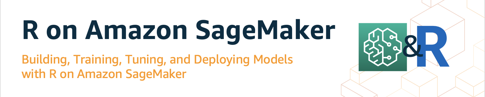

# Using R on Amazon SageMaker

---

**Revisions log:**

April 15, 2021 Revisions:
- Notebooks were updated to SageMaker v2.0
- Docker file updated to use Amazon ECR Public Gallery base images
- `paws` library is removed from notebooks, and replaced with `reticulate` and AWS `boto3` python SDK.

**Disclaimer:**

- The content provided in this repository is for demonstration purposes and not meant for production. You should use your own discretion when using the content.
- The ideas and opinions outlined in these examples are my own and do not represent the opinions of AWS.

This GitHub repository provides examples of coding in R in SageMaker environment. These examples include the following:

1. [Running RStudio on EC2 Instance](https://github.com/nickminaie/amazon-sagemaker-r-workshop/tree/main/r_rstudio_ec2)
  This example explains how to run a CloudFormation stack to provision an EC2 Instance with all necessary resources to run RStudio.

2. [Using R Kernel in SageMaker Notebook Instances: Basic Hello World Example](https://github.com/nickminaie/amazon-sagemaker-r-workshop/tree/main/r_sagemaker_hello_world)
  This is a simple example for writing R script in SageMaker, downloading data, processing and visualizing data, and then storing the data to S3.

3. [Using R Kernel in SageMaker Notebook Instance: End-2-End Example](https://github.com/nickminaie/amazon-sagemaker-r-workshop/tree/main/r_end_2_end)
  This sample Notebook describes how to train, deploy, and retrieve predictions from a machine learning (ML) model using Amazon SageMaker and R. The model predicts abalone age as measured by the number of rings in the shell. The reticulate package will be used as an R interface to Amazon SageMaker Python SDK to make API calls to Amazon SageMaker. The reticulate package translates between R and Python objects, and Amazon SageMaker provides a serverless data science environment to train and deploy ML models at scale.

4. [SageMaker Batch Transform using R Kernel](https://github.com/nickminaie/amazon-sagemaker-r-workshop/tree/main/r-batch-transform)
    This sample Notebook describes how to conduct batch transform using SageMaker Transformer in R. The notebook uses Abalone dataset and XGBoost regressor algorithm.

5. [Bring Your Own R Algorithm to SageMaker](https://github.com/nickminaie/amazon-sagemaker-r-workshop/tree/main/r_byo_algo)
  This notebook will focus mainly on the integration of hyperparameter tuning and a custom algorithm container, as well as hosting the tuned model and making inference using the endpoint.

6. [Hyperparameter Optimization for XGBoost in R and Batch Transform](https://github.com/nickminaie/amazon-sagemaker-r-workshop/tree/main/r_xgboost_hpo_batch_transform)
  This sample Notebook describes how to conduct Hyperparamter tuning and batch transform to make predictions for abalone age as measured by the number of rings in the shell. The notebook will use the public abalone dataset hosted by UCI Machine Learning Repository.

7. [Using Spark EMR Clusters in SageMaker with R Kernel](https://github.com/nickminaie/amazon-sagemaker-r-workshop/tree/main/r_sagemaker-sparkr)
  The purpose of this example is to demonstrate how SageMaker notebook with R kernel can be connected to an EMR cluster using SparklyR package to process Spark job including data processing, SQL queries, Machine Learning, and data read/write in different formats. The example uses `iris`, `abalone`, and `mtcars` public datasets.

8. [Creating a Persistent Custom R Environment for SageMaker Notebook Instances](https://github.com/nickminaie/amazon-sagemaker-r-workshop/tree/main/r-custom-kernel-notebooks)
  The instructions outlined in this example will walk you through the steps to create a custom R environment with user-specific packages for Amazon SageMaker notebook instances, and make the environment persistent between sessions, and also to use the environment in creating new SageMaker instances.
  
9. [Creating a Custom R Environment for SageMaker Studio](https://aws.amazon.com/blogs/machine-learning/bringing-your-own-r-environment-to-amazon-sagemaker-studio/)
  This blog provides instructions for building and attaching a custom R evironment to your SageMaker Studio domain.
   
   
These examples utilize the following library that provides R interfaces for AWS SageMaker and AWS services:

- [`Reticulate` library](https://rstudio.github.io/reticulate/): that provides an R interface to make API calls Amazon SageMaker Python SDK to make API calls to Amazon SageMaker. The reticulate package translates between R and Python objects, and Amazon SageMaker provides a serverless data science environment to train and deploy ML models at scale.

## More Useful Resources:
- Amazon SageMaker R Examples: https://github.com/awslabs/amazon-sagemaker-examples/tree/master/r_examples
- Blog: [Coding with R on Amazon SageMaker notebook instances](https://aws.amazon.com/blogs/machine-learning/coding-with-r-on-amazon-sagemaker-notebook-instances/)
- Blog: [Creating a persistent custom R environment for Amazon SageMaker Notebooks](https://aws.amazon.com/blogs/machine-learning/creating-a-persistent-custom-r-environment-for-amazon-sagemaker/)
- Blog: [Bringing your custom R environment to SageMaker Studio](https://aws.amazon.com/blogs/machine-learning/bringing-your-own-r-environment-to-amazon-sagemaker-studio/)

