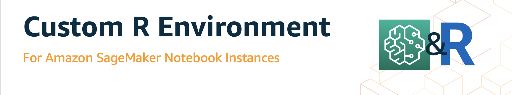
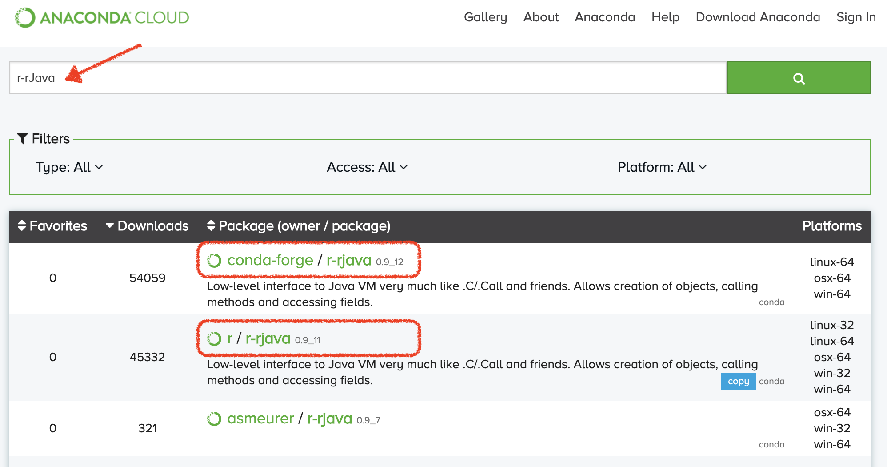
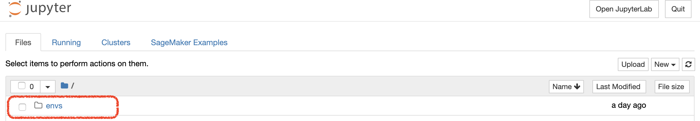
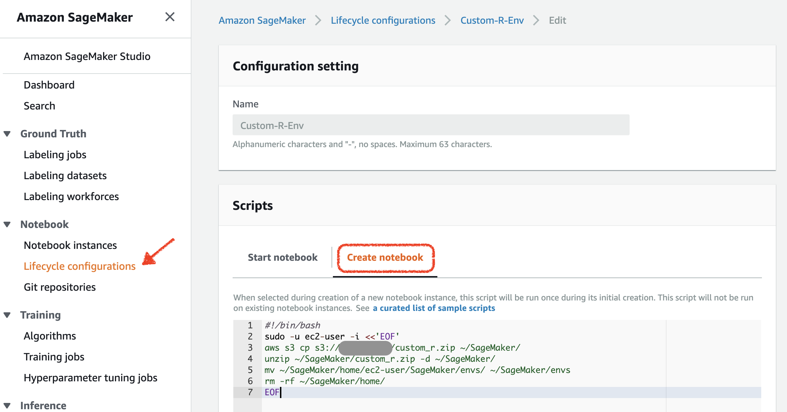
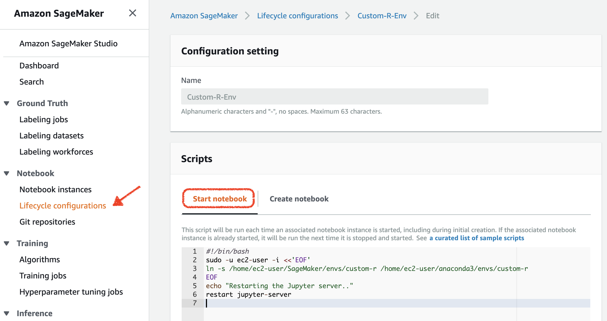
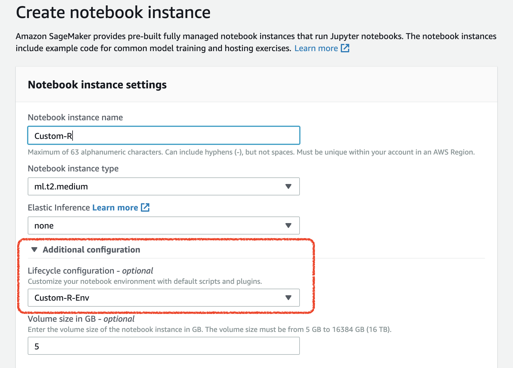
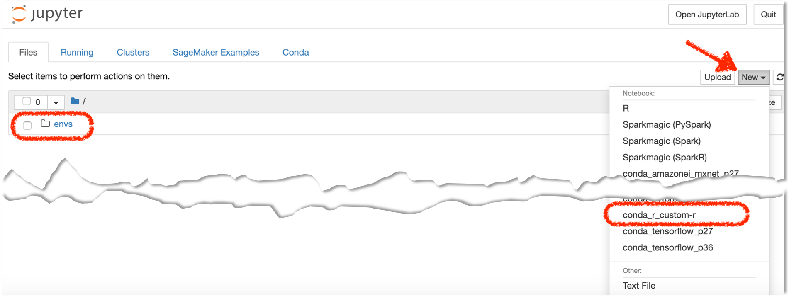
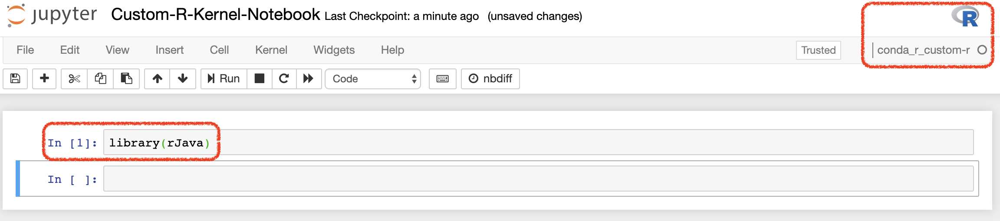

# Creating a Persistent Custom R Environment for SageMaker
<p align="center">

</p>

---

**Disclaimer:
The content provided in this repository is for demonstration purposes and not meant for production. You should use your own discretion when using the content.**

The instructions outlined in this `README.md` file will walk you through the steps to create a custom R environment with user-specific packages for Amazon SageMaker.

### Table of Contents
- [Background](#Background)
- [Installing Packages in SageMaker R Kernel](#Installing-Packages-in-SageMaker-R-Kernel)
  - [Install From Anaconda Cloud](#Install-From-Anaconda-Cloud)
  - [Install from CRAN Archive](#Install-from-CRAN-Archive)
  - [Install Directly from Github](#Install-Directly-from-Github)
- [Sample Code for Installing R Packages](#Sample-Code-for-Installing-R-Packages)
- [Persisting the Custom R Environment Between Sessions](#Persisting-the-Custom-R-Environment-Between-Sessions)
  - [Saving the Env on SageMaker EBS](#Saving-the-Env-on-SageMaker-EBS)
  - [Saving the Environment to S3 for Creating New SageMaker Instances](#Saving-the-Environment-to-S3-for-Creating-New-SageMaker-Instances)
  - [Lifecycle Configuration for Creating New Instances](#Lifecycle-Configuration-for-Creating-New-Instances)
  - [Lifecycle Configuration for Starting The Instance with Custom R Env](#Lifecycle-Configuration-for-Starting-The-Instance-with-Custom-R-Env)
- [Assigning Lifecycle Config to SageMaker Instance](#Assigning-Lifecycle-Config-to-SageMaker-Instance)
- [Using the Custom R Environment](#Using-the-Custom-R-Environment)
- [References](#References)

### Background
In August 2019, Amazon SageMaker released the [availability of pre-installed R kernel](https://aws.amazon.com/about-aws/whats-new/2019/08/amazon-sagemaker-notebooks-available-with-pre-installed-r-kernel/) in all regions. The news release mentions:


> Amazon SageMaker notebooks now support R out-of-the-box, without needing you to manually install R kernels on the instances. Also, the notebooks come pre-installed with the reticulate library that offers an R interface for the Amazon SageMaker Python SDK enabling you to invoke Python modules from within an R script.  

The R kernel is SageMaker is built using [IRKernel](https://github.com/IRkernel/IRkernel) package, which installs "a kernel with the name 'ir' and a display name of 'R'" in Jupyter environment.

Using [Conda](https://docs.conda.io/en/latest/), we can manage this environment, and install specific packages and dependencies. However, by default, installed from a Notebook Instance will not be persisted to the next Notebook Instance session, and everytime the user stops/starts a SageMaker instance, the R kernel will go back to its default environment.

This example will walk you through the process of installing R packages in SageMaker using different sources:
- Anaconda
- CRAN
- Install from Github

Once we create the desired environment, we will save the environment on SageMaker instance's EBS storage, to make it persistent. In addition, we will show how to store this environment on S3 and use it to build custom R environment for new SageMaker instances. We will use [Lifecycle Configuration](https://docs.aws.amazon.com/sagemaker/latest/dg/notebook-lifecycle-config.html) for this purpose.

### Installing Packages in SageMaker R Kernel
SageMaker's R kernel comes with R-base's over 140 standard packages. These packages are listed in this file ([SageMaker R Kernel Standard Packages](.SageMaker-Standard-R-Packages.txt)).

If you need to install additional packages, you have multiple options:

#### Install From Anaconda Cloud
The preferred method for installing R packages is to install the package from Anaconda Cloud repository. Using this method, you can access to different channels (e.g. R, Conda Forge, etc.), which allows you to install specific versions of the package. If you are doing this inside SageMaker using R kernel, you will to use `system()` command to submit the `conda install` command. If you are installing this in the terminal, you can just use `conda install`.

Within SageMaker:
```
system("conda install -n R -c conda-forge r-rjava")

```
In the above code, we are using the `conda-forge channel`, which will install rJava version 0.9_12. Howeverm if we use the following (which uses `r channel`), it will install version 0.9_11.

```
system("conda install -n R -c r r-rjava")

```
You can visit [https://anaconda.org/](https://anaconda.org/) and search for the specific package name and choose the right channel for the specific version you are interested in.

<p align="center">


</p>

**The recommendation** is to **use conda** as the preferred method to install packages and Anaconda as the preferred archive, as it provides access to the most stable versions for conda environments.

#### Install from CRAN Archive
The next method is using CRAN archive. The Comprehensive R Archive Network (CRAN) [https://cran.r-project.org/](https://cran.r-project.org/) is a network of ftp and web servers around the world that store identical, up-to-date, versions of code and documentation for R. You can use this archive to install packages in R, using `install.packages()`. This will install the latest version of the package.

```
install.packages(c('mlbench', 'MVar'),
      repo = 'http://cran.rstudio.com',
      dependencies = TRUE)
```

then you can import that package to your R code by:
```
library(mlbench)
```
You should keep in mind that SageMaker instances use [Amazon Linux AMI](https://aws.amazon.com/amazon-linux-ami/) which is a distribution that evolved from Red Hat Enterprise Linux (RHEL) and CentOS. It is available for use within Amazon EC2 instances that run SageMaker. Therefore, if you are planning to install packages directly from the source, make sure you select the right operating system. You can check the operating system with the following command in the SageMaker terminal:

```
sh-4.2$ cat /etc/os-release

NAME="Amazon Linux AMI"
VERSION="2018.03"
ID="amzn"
ID_LIKE="rhel fedora"
VERSION_ID="2018.03"
PRETTY_NAME="Amazon Linux AMI 2018.03"
ANSI_COLOR="0;33"
CPE_NAME="cpe:/o:amazon:linux:2018.03:ga"
HOME_URL="http://aws.amazon.com/amazon-linux-ami/"
```

#### Install Directly from Github
You can also use `devtools` and `install_github` to get the content directly from the package developer's repo. For this you can follow this code:
```
install.packages("devtools")
devtools::install_github("malcolmbarrett/ggdag")
```
This will install the package and its dependencies.

### Sample Code for Installing R Packages
The sample code in this current repo illustrates how installing packages from different sources can be achieved. You can copy and paste this code in a SageMaker notebook with R Kernel, and customize it based on the packages you want to install. Running this sample code will take a long time due to the size and number of packages it installs.

[Sample Code for Installing R Packages](.sample_installing_r_packages.R)

### Persisting the Custom R Environment Between Sessions
By default, SageMaker launches the base R kernel every time you stop and start a SageMaker instance. That means, the additional packages that you install, will be lost when you stop the instance, and when you start the instance again you will need to re-install packages. This will be time consuming and cumbersome.
The solution to make the custom environment is to save the environment on the EBS storage of the instance, and then link it a custom R kernel upon start using [SageMaker Lifecycle Configuration script](https://docs.aws.amazon.com/sagemaker/latest/dg/notebook-lifecycle-config.html). This section outlines the steps to make the custime R environment that we created in the previous section persistent.

#### Saving the Env on SageMaker EBS
First we need to save the environment on the instance's EBS storage. This can be done by cloning the environment:
```
conda create --prefix /home/ec2-user/SageMaker/envs/custom-r --clone R
```
This will create a `envs/custom-r` folder under the `SageMaker` folder on your instance EBS, which you have access to.
<p align="center">

</p>

If you are planning to use this custom environment in the same SageMaker instance later (and not in a different instance), you can skip to [Lifecycle Configuration for Starting The Instance with Custom R Env](#Lifecycle-Configuration-for-Starting-The-Instance-with-Custom-R-Env) step.

#### Saving the Environment to S3 for Creating New SageMaker Instances
If you are planning to use the custom R environment again and again when creating this SageMaker instance (e.g. for your development team), you can save this environment to S3 as a `.zip` file, and then download that to the instance at `Create` stage.
```
zip -r ~/SageMaker/custom_r.zip ~/SageMaker/envs/
aws s3 cp ~/SageMaker/custom_r.zip s3://[YOUR BUCKET]/
```

#### Lifecycle Configuration for Creating New Instances
If you want to create a new instance and use the custom environment in that instance, you need to bring the `.zip` environment from S3 to the instance. You can do this automatically using the Lifecycle Configuration script for `Create notebook` stage. Let's create a lifecycle config and name it **"Custom-R-Env"**.


<p align="center">

</p>

This script, downloads the `.zip` file from S3 to the `/SageMaker/` folder on the instance's EBS, unzips the file, recreates the `/envs/` folder, and removes the redundant folders.

This script can be found here in the repo:
- [custom_r_create_lifecycle_config.sh](.custom_r_create_lifecycle_config.sh)

```
## On-Create: Bringing custom environment from S3 to SageMaker instance
## NOTE: Your SageMaker IAM role should have access to this bucket

#!/bin/bash    
sudo -u ec2-user -i <<'EOF'
aws s3 cp s3://[YOUR BUCKET]/custom_r.zip ~/SageMaker/
unzip ~/SageMaker/custom_r.zip -d ~/SageMaker/
mv ~/SageMaker/home/ec2-user/SageMaker/envs/ ~/SageMaker/envs
rm -rf ~/SageMaker/home/
rm ~/SageMaker/custom_r.zip
EOF
```

#### Lifecycle Configuration for Starting The Instance with Custom R Env
This step is the same whether you created the custom R environment in the same instance and cloned it to `./envs/` folder, or you downloaded the `.zip` file from S3 while creating the instnace.

You can use the script in the repo for this purpose, and add it to `Start notebook`. You can add it to the same lifecycle config **"Custom-R-Env"**.

- [custom_r_start_lifecycle_config.sh](.custom_r_start_lifecycle_config.sh)

<p align="center">

</p>

This script creates a symbolic link between the `./evns/` folder (which contains the custom R environment) and the `anaconda custom-r` environment. This will allow the `custom-r` to be listed under the kernels in SageMaker.

```
## On-Start: After you set up the environment in the instance
## then you can have this life-cycle config to link the custom env with kernel

#!/bin/bash    
sudo -u ec2-user -i <<'EOF'    
ln -s /home/ec2-user/SageMaker/envs/custom-r /home/ec2-user/anaconda3/envs/custom-r
EOF
echo "Restarting the Jupyter server..."
restart jupyter-server
```

### Assigning Lifecycle Config to SageMaker Instance
You can visit [Customize a Notebook Instance Using a Lifecycle Configuration Script](https://docs.aws.amazon.com/sagemaker/latest/dg/notebook-lifecycle-config.html) to get more details about SageMaker Lifecycle Configuration.

To create a notebook with this lifecycle config (**Custom-R-Env**), you need to assign the script to the notebook under **"Additional Configuration"**. Other steps would be the same as creating any SageMaker instance.

<p align="center">

</p>

### Using the Custom R Environment
If you are opening your existing instance where you created the custom environment, you should see your existing files and codes, as well as the `/envs/` folder.

But if you are creating a new instance and used the lifecycle script to bring the environment from S3, then once your instance in **<span style="color:green">In Service.</span>**, open Jupyter. You should see a `/envs/` folder already in your SageMaker files. That is your custom environment. Under **New**, select **conda_r_custom-r** kernel, and you will have a notebook with your custom R environment.

<p align="center">

</p>

When in your notebook, you should see the  logo on the upper right corner which indicates the kernel is an R kernel, and also the name of your kernel should be **conda_r_custom-r**. To test the environment, import one of the libraries that you included in the custom environment (e.g. **rJava**).
```
library(rJava)
```

<p align="center">

</p>

### References
In preparation of this example, the following resources were used. I would like to acknowledge these great resources and their authors for contributing to the community:
- [IRKernel github repository](https://github.com/IRkernel/IRkernel)
- [Customize a Notebook Instance Using a Lifecycle Configuration Script](https://docs.aws.amazon.com/sagemaker/latest/dg/notebook-lifecycle-config.html)
- [The Comprehensive R Archive Network](https://cran.r-project.org/index.html)
- [Anaconda Cloud](https://anaconda.org/)
- [SageMaker Notebook Instance Lifecycle Config Samples](https://github.com/aws-samples/amazon-sagemaker-notebook-instance-lifecycle-config-samples)
