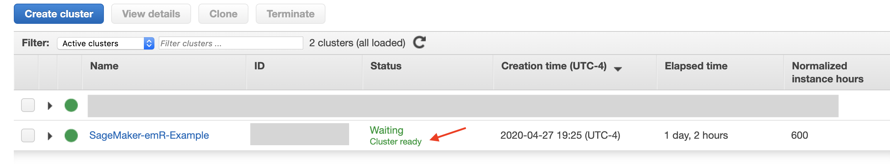
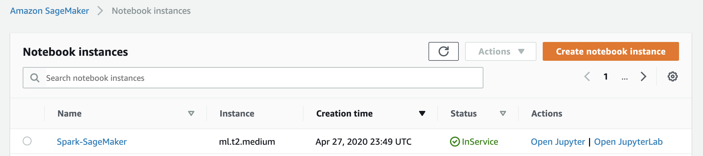

# Using Spark EMR Clusters in SageMaker with R Kernel
<p align="center">


</p>

---

**Disclaimer:
The content provided in this repository is for demonstration purposes and not meant for production. You should use your own discretion when using the content.**

The instructions outlined in this `README.md` file will walk you through the steps to create an EMR cluster, and SageMaker notebook with R kernel, and establish the connection between your SageMaker R notebook and the EMR cluster so you can submit your Spark job to the cluster.

Once you have followed these steps, you can visit the example notebook in this repo and follow along for example code in SparkR for data ingestion, data processing, SQL query, and Machine Learning.

[Using Spark EMR Clusters in SageMaker with R Kernel](SparkR+SageMaker.ipynb)

### Table of Contents
- [Background](#Background)
  - [SparklyR](#SparklyR)
  - [Amazon EMR](#Amazon-EMR)
  - [Apache Livy](#Apache-Livy)
- [Connect SageMaker Notebook to EMR cluster](#Connect-SageMaker-Notebook-to-EMR-cluster)
  - [Set Up Virtual Private Cloud (VPC)](#Set-Up-Virtual-Private-Cloud-(VPC))
  - [Create an EMR Cluster with Livy Application](#Create-an-EMR-Cluster-with-Livy-Application)
    - [Upload Bash Transcripts to S3](#Upload-Bash-Transcripts-to-S3)
    - [Create an EMR Cluster: AWS EMR Console](#create-an-emr-cluster-aws-emr-console)
    - [Create an EMR Cluster: Alternative Method-AWS CLI](#create-an-emr-cluster-alternative-method-aws-cli)
  - [Set Up Security Groups and Open Ports](#Set-Up-Security-Groups-and-Open-Ports)
  - [Set Up A SageMaker Notebook Instance](#Set-Up-A-SageMaker-Notebook-Instance)
  - [Connect the SageMaker Instance to Amazon EMR](#Connect-the-SageMaker-Instance-to-Amazon-EMR)
  - [Test the Connection between the SageMaker Instance and Amazon EMR](#Test-the-Connection-between-the-SageMaker-Instance-and-Amazon-EMR)
  - [Establish the Connection between a Notebook and Amazon EMR](#Establish-the-Connection-between-a-Notebook-and-Amazon-EMR)
- [References](#References)


### Background
#### SparklyR
 The [Sparklyr](https://spark.rstudio.com/) package by RStudio makes big data processing capabilities in R a lot easier by providing an R interface to [Apache Spark](https://spark.apache.org/). According to the documentation, `SparklyR` can:
> - Connect to Spark from R. The sparklyr package provides a complete [dplyr](https://github.com/hadley/dplyr) backend.
> - Filter and aggregate Spark datasets then bring them into R for analysis and visualization.
> - Use Spark’s distributed [machine learning](http://spark.apache.org/docs/latest/mllib-guide.html) library from R.
> - Create [extensions](http://spark.rstudio.com/extensions.html) that call the full Spark API and provide interfaces to Spark packages.

#### Amazon EMR
 Amazon EMR is a popular hosted big data processing service on AWS. EMR provides the latest version of Spark and other Hadoop ecosystem applications such as Apache Spark, Apache Hive, Apache HBase, as well as Hue, Sqoop, Tez, Zeppeling, TensorFlow, and Presto. [Amazon EMR](https://aws.amazon.com/emr/) mentions:
> Amazon EMR is the industry-leading cloud big data platform for processing vast amounts of data using open source tools such as Apache Spark, Apache Hive, Apache HBase, Apache Flink, Apache Hudi, and Presto. With EMR you can run Petabyte-scale analysis at less than half of the cost of traditional on-premises solutions and over 3x faster than standard Apache Spark. For short-running jobs, you can spin up and spin down clusters and pay per second for the instances used. For long-running workloads, you can create highly available clusters that automatically scale to meet demand. If you have existing on-premises deployments of open source tools such as Apache Spark and Apache Hive, you can also run EMR clusters on AWS Outposts.

#### Apache Livy
 [Apache Livy](https://livy.apache.org/) is a REST Service for Apache Spark that allows submission of jobs to Spark clusters from anywhere using REST interfaces. The documentation mentions:
> Apache Livy enables easy interaction with a Spark cluster over a REST interface. It enables easy submission of Spark jobs or snippets of Spark code, synchronous or asynchronous result retrieval, as well as Spark Context management, all via a simple REST interface or an RPC client library.

The instructions outlined in this README.md file will walk you through the steps required to create establish the communication between SageMaker notebook instances and EMR clusters for submission of Spark jobs from SagMaker to EMR. Following these steps, you will:
- Set up VPCs and Security groups
- Create an EMR cluster with Livy that allows submission of jobs from SageMaker
- Create a SageMaker Instance that can connect with EMR

### Connect SageMaker Notebook to EMR cluster
In order to establish this connection, we need other components related to the network and security groups that would allow the communication between the two entities. We will establish **Virtual Private Cloud (VPC)** and **Security Groups** for this purpose.

#### Set Up Virtual Private Cloud (VPC)
[Amazon Virtual Private Cloud](https://aws.amazon.com/vpc/) lets you provision a logically isolated section of the AWS Cloud where you can launch AWS resources in a virtual network that you define.
To create a new VPC, you can visit this page for [Getting started with IPv4 for Amazon VPC](https://docs.aws.amazon.com/vpc/latest/userguide/getting-started-ipv4.html) and follow these steps:

 Follow the steps in [Create a new VPC with IPv4](https://docs.aws.amazon.com/vpc/latest/userguide/getting-started-ipv4.html#getting-started-create-vpc) to create a VPC.

When doing this use the following input:
  - Name tag: sagemaker-sparklyr
  - IPv4 CIDR block: 10.0.0.0/16
  - Leave everything else as default


#### Create an EMR Cluster with Livy Application

 For more details about creating a custom EMR cluster, please visit [Getting Started: Analyzing Big Data with Amazon EMR](https://docs.aws.amazon.com/emr/latest/ManagementGuide/emr-gs.html) page.

##### Upload Bash Transcripts to S3
- Visit [AWS GitHub repo]() and download the two bash script files. These files are:
**emR_bootstrap.sh** - installs RStudio and RHadoop packages depending on the provided arguments on all EMR instances

  - --rstudio - installs rstudio-server, default false
  - --rhdfs - installs rhdfs package, default false
  - --plyrmr - installs plyrmr package, default false
  - --updater - installs latest R version, default false
  - --user - sets user for rstudio, default "rstudio"
  - --user-pw - sets user-pw for user USER, default "rstudio"
  - --rstudio-port - sets rstudio port, default 80

This file also sets the username/password for RStudio, but using SageMaker, we will not need this.

**hdfs_permission.sh** - fixes /tmp permission in hdfs to provide temporary storage for R streaming jobs.

- Create a S3 bucket and upload these two `.sh` files in that bucket (/subfolder).

##### Create an EMR Cluster: AWS EMR Console
We will create an EMR cluster with one master node and four core nodes that will have the following applications:
- Hadoop 2.8.5
- Hive 2.3.6
- Pig 0.17.0
- Hue 4.4.0
- Spark 2.4.4
- Livy 0.6.0
- Tez 0.9.2
- Ganglia 3.7.2

This image shows this configuration (Image from AWS [Overview of Amazon EMR](https://docs.aws.amazon.com/emr/latest/ManagementGuide/emr-overview.html))


To do this, open the AWS EMR console, **Create cluster** and switch to **Advanced Options**.

Under **Software Configuration**, Sslect the software applications you want to install on the cluster.


Under **Steps(Optional)** add a **Custom Jar** step. You will need to add the JAR location, and pass on the location of the `.sh` file in your S3 bucket as argument.

- Step Name: HDFS_tmp_permission
- JAR location: s3://elasticmapreduce/libs/script-runner/script-runner.jar
- Argument: s3://[your-bucket/prefix]/hdfs_permission.sh


Click **Next** to go to **Hardware Configuration** page. For this example, we will use one Master and four Core nodes, but you can customize this for your use case. We will also leave other options as default.

For **Network** select the VPC that you created in the previous step (called sagemaker-sparklyr) in this case. Also, for **EC2 Subnet** select one of the VPC subnets from he menu and make a note of your EC2 Subnet because you will need this later when creating your SageMaker notebook instance.


Click next, and under **General Options**, add a name for your cluster, in this case ***SageMaker-emR-Example***. Under **Additional Options --> Add Bootstrap Action --> Custom Action**


- Name: emR_bootstrap
- Script Location: s3://[your-bucket/prefix]/emR_bootstrap.sh
- Optional Arguments: --rstudio,--rhdfs,--plyrmr,--rexamples

**Note:** For optional arguments, you do not need to add `--rstudio` since we will be using `SageMaker`, but this is to demo how you can install different applications using the arguments.


For **Security Options**, we are going to leave to all options as default and select "Proceed without an EC2 KeyPair" since this will be in the same VPC with SageMaker. Feel free to include any other options to your cluster that you think might be appropriate, such as adding key pairs for remote access to nodes. You will need a KeyPay to SSH into the nodes outside of SageMaker.


Create the cluster, and wait until the status is "**Waiting - Cluster ready"** in **Green**, then choose the cluster you created. Choose the **Hardware** tab.



Choose your Master’s ID, and then scroll right to find **Private IP** Address. Save this for later. In this example, this is 10.0.0.53, but yours will be different.


##### Create an EMR Cluster: (Alternative Method) AWS CLI
Alternatively, you can use AWS CLI to create the EMR cluster. For this, you can visit this example on [AWS GitHub repo for EMR Bootstrap Actions for R](https://github.com/aws-samples/emr-bootstrap-actions/blob/master/R/Hadoop/README.md) and revise the command for your case.

Here's the command from this [AWS GitHub repo](https://github.com/aws-samples/emr-bootstrap-actions/blob/master/R/Hadoop/README.md) as a sample without modification. Note this command installs rstudio, rhdfs, plyrmr, and rexamples packages on the cluster, and creates a cluster with 3 nodes, one master and two cores.

```
bucket="<YOUR_BUCKET>"
region="<YOUR_REGION>"
keypair="<YOUR_KEYPAIR>"

aws emr create-cluster --name emR-example \
--ami-version 3.2.1 \
--region $region \
--ec2-attributes KeyName=$keypair \
--no-auto-terminate \
--instance-groups \
InstanceGroupType=MASTER,InstanceCount=1,InstanceType=m1.large \
InstanceGroupType=CORE,InstanceCount=2,InstanceType=m1.large \
--bootstrap-actions \
Name=emR_bootstrap,\
Path="s3://$bucket/emR_bootstrap.sh",\
Args=[--rstudio,--rhdfs,--plyrmr,--rexamples] \
--steps \
Name=HDFS_tmp_permission,\
Jar="s3://elasticmapreduce/libs/script-runner/script-runner.jar",\
Args="s3://$bucket/hdfs_permission.sh"
```
#### Set Up Security Groups and Open Ports
Next we need to create and set up a security group, and then open the relevant ports, so our Amazon SageMaker notebook can talk to the EMR cluster via Livy on port 8998.

 For instructions  visit [Create a security group](https://docs.aws.amazon.com/vpc/latest/userguide/getting-started-ipv4.html#getting-started-create-security-group) on Amazon VPC page.

To start, visit **EC2** service page on AWS console, and then go to **Security Groups** (under Network & Security) and then **Create Security Group**.

Set a Security Group Name (In this example sagemaker-notebook), a Description, and the VPC you used for your EMR cluster (In this example is sagemaker-sparklyr). This will create the SG for your SageMaker notebook, making it possible for us to only open the port to instances that are in this group. We still need to open the port in our ElasticMapReduce-master group.


When creating EMR cluster, EMR automatically creates security groups for the master node and other nodes. We need to modify the SG for the master node, and allow inbound traffic via post 8998.


Select the the SG for that master node, and then **Edit Inbound Rules**. Add the following inbound rule, and save.
- Type: Custom TCP
- Protocol: TCP
- Port range: 8998
- Source: [your sagemaker-notebook security group]
- Description" Livy Port

What happened was that You opened up communication port between your SageMaker notebook instance and your EMR cluster over Livy. Next we will create a SageMaker notebook instance using the VPC and security group.


#### Set Up A SageMaker Notebook Instance
 For instructions on how to create  SageMaker notebook instance visit [Create a Notebook Instance](https://docs.aws.amazon.com/sagemaker/latest/dg/howitworks-create-ws.html).

Up until this point, we have created:
- A VPC and subnet
- EMR cluster with one master and four core nodes, and proper applications
- Security group for the sagemaker Notebook
- Security group for the EMR cluster (automatically) and revised the master security group to allow incoming traffic via port (8998, Livy) from the sagemaker security group

Next, we are going to create a SageMaker notebook and test the connection to the EMR cluster.

Go to the SageMaker console, and **Create Notebook Instance**. Follow these steps:
- Give your notebook instance a Name, in this example "Spark-SageMaker" (The name should be unique in your account in that region)
- Select an instance type, in this example "ml.t2.medium"
- Either create a new IAM role or use an existing role. The IAM role should have **AmazonSageMakerFullAccess**, plus access to any necessary Amazon Simple Storage Service (Amazon S3) buckets. You can also have SageMaker create a role for you.

Under **Network** select the VPC, Subnet, and Security Group that you have created for your sagemaker.
- VPC: sagemaker-sparklyr
- Subnet: This is the subnet that you selected for EC2 when you created the EMR cluster.
- Security Group(s): Select "sagemaker-notebook" security group that you created for this purpose.

Then create the notebook. This will take a couple of minutes while SageMaker provisions the environment for your notebook.


Wait until the status of your SageMaker instance changes to "In Service" in green.



So far, we have given the notebook permission to connect to EMR, but we have established the connect. That what we will do in the next step.

#### Connect the SageMaker Instance to Amazon EMR
Select **Open Jupyter**, and then from **New** select **Terminal**. This will open a terminal console for you.


Execute the following commands. These will get the `example_config.json` from [Jupyter Incubator SparkMagic GitHub repo](https://github.com/jupyter-incubator/sparkmagic/) and bring it to your `.sparkmagic/` directory. Next line will chage the name to `config.json`.

```
cd .sparkmagic
wget https://raw.githubusercontent.com/jupyter-incubator/sparkmagic/master/sparkmagic/example_config.json
mv example_config.json config.json
```
You should see the outputs like this:


Then you need to edit the `config.json` file. To do this, you can use the following command in terminal while still in `.sparkmagic/` directory:
```
nano config.json
```
You will see a screen like below. If you remember, when you created the EMR cluster, there was a master node, and four core nodes. The master node had a Private IP adress, which in this example is `10.0.0.53`. If you need help finding this IP address, refer back to the section where we created the EMR cluster using Method 1, AWS Console).

Use `^\` (`control+\ on Mac`) to replace `localhost` with the private IP addres on your EMR master node (in this example, `10.0.0.53`).

Then press `^X` (`control+X on Mac`) to exit. It will ask you to save the document.


#### Test the Connection between the SageMaker Instance and Amazon EMR
Next we need to test the connection. For this, while in the terminal, run the following command. Replace the `EMR Master Private IP` with the Private IP address of your EMR master node, in this example `10.0.0.53`. This will test the connection to the master node via post 8998 (livy). Once you run the command, your output should be like the following, otherwise, your connection has not been successfuly established. In that case, make sure you check out the Security Groups, the inbound rules to allow port 8998 open, and also the VPC configuraion (follow the previous steps to ensure proper configuration).

```
curl <EMR Master Private IP>:8998/sessions
```


Run `exit` in the terminal, close the terminal, and go to the next step.

#### Establish the Connection between a Notebook and Amazon EMR
Next, you can establish the connection between your SageMaker notebook and your EMR cluster, so you can submit jobs to your cluster using R.

Start a new notebook using `R Kernel` (see below).


Then run the following code. Make sure you replace the EMR Master public DNS with your EMR's info.


```
# Install sparklyr package
install.packages("sparklyr")
library(sparklyr)

# Master public DNS
# Replace this with the EMR public DNS from EMR details
emr_dns <- '[YOUR EMR MASTER PUBLIC DNS]'
master_port <- paste(emr_dns,':8998',sep = '')
master_port

# Establish Connetion with EMR cluster's mater instance through port 8998 using livy method
sc <- spark_connect(master = master_port,
            method = 'livy',
            version ='2.4.4',
            spark_home = Sys.getenv("SPARK_HOME"),
            app_name = "sparklyr")

# Check if connection is established
spark_connection_is_open(sc)
```

When you run this code in R kernel in SageMaker, you should receive `TRUE`, indicating the connection is established.


After this step, you can visit this example that will walk you through submitting jobs to the EMR cluster, including data processing, machine learning, and SQL queries.

[Using Spark EMR Clusters in SageMaker with R Kernel](SparkR+SageMaker.ipynb)

### References
In preparation of this example, the following resources were used. I would like to acknowledge these great resources and their authors for contributing to the community:
- [Running open-source R on EMR with RHadoop packages and RStudio](https://github.com/aws-samples/emr-bootstrap-actions/blob/master/R/Hadoop/README.md)
- [Build Amazon SageMaker notebooks backed by Spark in Amazon EMR](https://aws.amazon.com/blogs/machine-learning/build-amazon-sagemaker-notebooks-backed-by-spark-in-amazon-emr/)
- [Running sparklyr – RStudio’s R Interface to Spark on Amazon EMR](https://aws.amazon.com/blogs/big-data/running-sparklyr-rstudios-r-interface-to-spark-on-amazon-emr/)
- [Spark Machine Learning Library (MLlib)](https://spark.rstudio.com/mlib/)
- [sparklyr: R interface for Apache Spark](https://spark.rstudio.com/)
